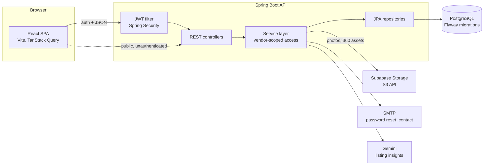

# MotorIQ, a dealership management platform

A multi-tenant web application that used-vehicle dealerships run their business on: stock, sales, customers, invoicing, investor funding, and a public buyer-facing catalogue. Built for independent dealers, with each dealer's data kept separate from every other's.

> The source is private. This is a writeup of how it works and the decisions behind it.

## The problem

Most small and mid-size used-vehicle dealers run on WhatsApp, spreadsheets, and paper receipts. Nobody can answer, in one place, what is in stock, how much each vehicle still owes in payments, who has invested in which car, and what is live on the public listing. This pulls all of that into one system per dealer, and puts the inventory in front of buyers through a public catalogue and a dealer-to-dealer marketplace.

## Architecture

The API is a single Spring Boot service. Requests pass a JWT filter, hit a controller, and go through a service layer that is responsible for scoping every query to the calling dealer. The public catalogue and marketplace use the same API but skip auth. Media lives in S3-compatible object storage, not in the database or on the app server.

## Engineering decisions

**Tenant isolation lives in the service layer.** Many dealers share one database, and none of them can ever see another's cars or sales. I scope every content query by the vendor id taken from the authenticated user, and I keep that scoping in the service layer rather than trusting each controller to remember it. The honest tradeoff: as far as the code goes, isolation rests on always going through that scoped path. There is no Postgres row-level security behind it as a second wall, so a single query that forgets to filter by vendor would leak across tenants. If I rebuilt this I would add an RLS policy on the vendor column as a backstop. I know the fix well because I applied it in a later project.

**The schema evolves only through ordered migrations.** The data model grew a lot over the life of the project: CRM, finance fields, an investor module, a marketplace, 360-degree photo assets. All of it happened while the app was running against a real database, so I never let Hibernate auto-generate DDL. Every change is a numbered Flyway migration, committed and forward-only. That costs a file for every column change, and in return the schema is reproducible and deploys are predictable.

**Auth uses short access tokens plus stored refresh tokens.** Pure stateless JWT is simple but you cannot revoke a token or end a session early. I kept access tokens short and stored refresh tokens in their own table so a refresh can be invalidated. That reintroduces a little server-side state to manage, which is the price of being able to log someone out for real.

**Media goes through object storage, not the JVM.** Vehicle photos and 360 assets are large and there are many of them. Serving those bytes from the application would tie up request threads and memory. Photos are written to S3-compatible storage and only their references live in Postgres, which keeps the API light at the cost of a hard dependency on external storage and signed-URL handling.

**Features are gated per dealer with flags.** Not every dealer wants the investor module, the dealer-network features, or the marketplace, and some of those are commercially distinct. Boolean flags on the vendor decide whether a module's endpoints and screens are active. This threads some conditional logic through the code, and in exchange capabilities can be turned on per tenant without branching the codebase.

## Stack

- Java 17, Spring Boot 3.2, Spring Security, Spring Data JPA / Hibernate
- PostgreSQL with Flyway migrations
- JJWT for tokens, Spring Mail for email
- Supabase Storage over the S3 API for media
- Gemini for listing insights
- React 19, Vite, TanStack Query, React Router, Tailwind, Recharts
- Vitest and Playwright on the frontend; GitHub Actions and Docker Compose

## On the roadmap

- **Database-level tenant isolation.** Adding a Postgres row-level security policy on the vendor column so isolation sits on two independent layers, the app-scoped access path and the database, rather than the application alone.
- **A backend test suite.** Focused first on the finance and isolation logic, the two places where a bug does the most damage.
- **Observability.** Structured logging, metrics, and error tracking, so a production issue is something you can see rather than reconstruct from raw logs.
- **A managed secrets story.** Moving configuration into a proper secrets manager.
- **Firmer module boundaries** as the codebase grows, so the monolith stays easy to reason about.

## Screenshots

Capture these three, save them under `screenshots/` with these names:

- `screenshots/inventory.png` — the main screen after login: the stock list showing vehicles in inventory.
- `screenshots/vehicle-finance.png` — a vehicle or sale detail that shows the money tracking (payments received and owed, any TCS or brokerage fields).
- `screenshots/public-catalogue.png` — the public, buyer-facing catalogue or marketplace page (the unauthenticated view a customer would see).

<!--

-->
